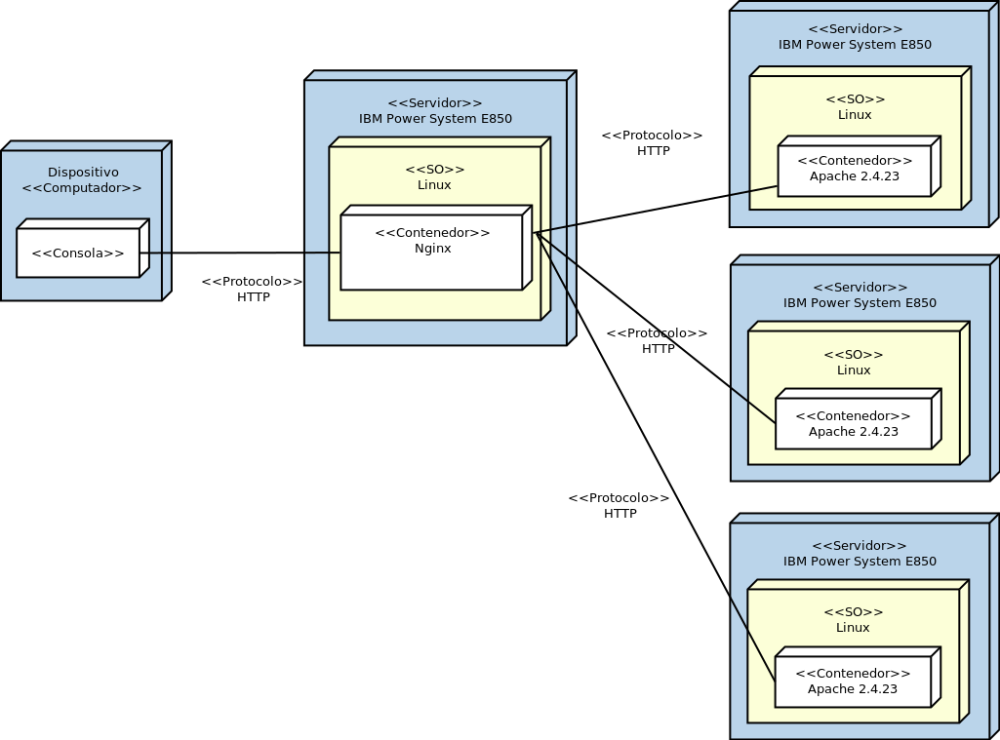
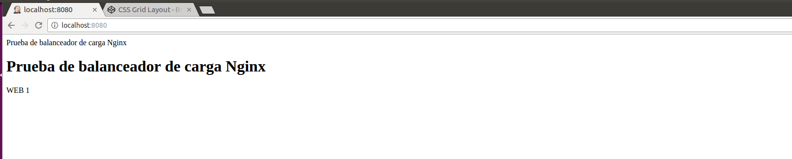
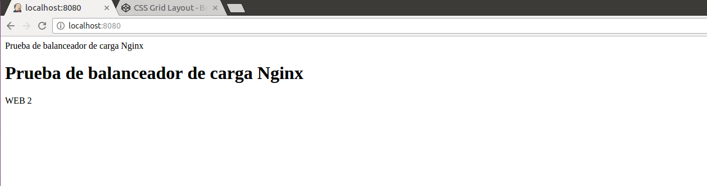
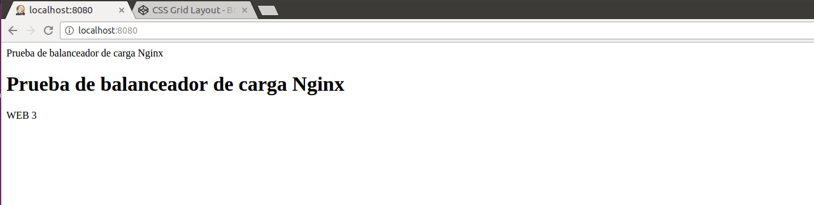
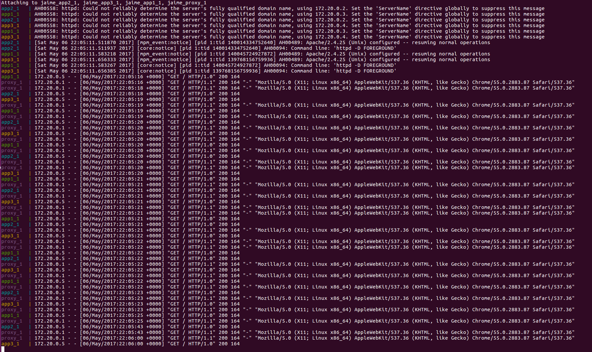
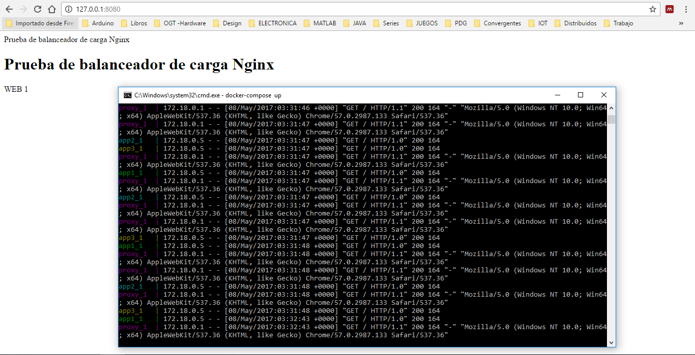
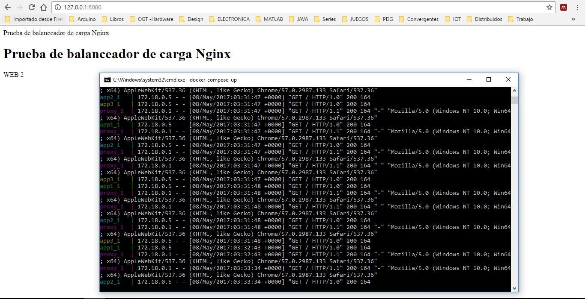
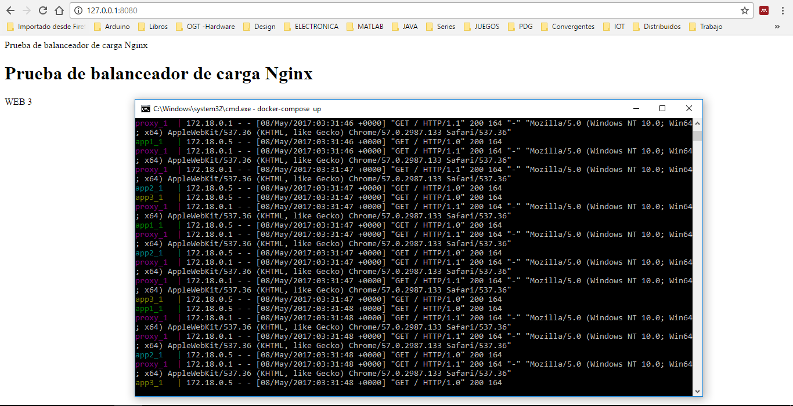

# sd-parcial2-2017a

#### Nombre Estudiante: Jaime Vélez Escandón
#### Código Estudiante: A00268524
#### Repositorio: https://github.com/jaimevlz7/sd-parcial2-2017a

### Descripción
Aprovisionamiento	de	un	ambiente	compuesto	por	los	siguientes	elementos:	un servidor	encargado de	realizar balanceo de	carga,	tres	servidores	web	con páginas estáticas. Se	debe probar	el	funcionamiento	del balanceador	realizando peticiones y mostrando servidores distintos atendiendo las peticiones.

<p align="center">
  
</p>


### Explicación:
Para el proyecto se necesitan desplegar 4 maquinas, 3 maquinas que funcionen como servidor web y 1 maquina con nginx que haga las veces de balanceador de carga. La siguiente actividad se realiza teniendo en cuenta que es un posible escenario en un contexto de empresarial de procesos productivos u operativos. <br>

Se utilizaron las imagenes de httpd (apache) y nginx, debido a la facilidad de configuración de cada una. Apache solamente recibe la aplicación web (backend y frontedn, si es el caso o index.html sencillo). Y nginx que funciona como un proxy (balanceador de carga) que solo necesita la configuración de su documento nginx.conf. <br>

A la hora de la configuración pensando en un ambiente de producción se hizo uso de los volumenes, para almacenar sus respectivos archivos de configuración de cada maquina.<br>

Adicionalmente cabe aclarar que por ser una actividad academica, se realizo creando 3 web en el docker-compose. Pero en situaciones practicas se utilizan los siguientes comandos:<br>

```
#docker-compose build .
#docker-compose scale app=3 proxy=1 up
```
Definiendo la cantidad de web (app en este caso) y los nginx (proxy en el ejemplo), habiendo configurado los nginx y web con anterioridad para una infraestructura a gran escala.<br>

### Desarrollo:

Inicialmente para el desarrollo del parcial:

#### 1. Configuración de las imagenes.

Se instalaron las imagenes extraidas de docker hub, httpd y nginx (Imagenes ya preconfiguradas y modificadas para funcionar correctamente) teniendo en cuenta que con estas imagenes se podia cumplir el objetivo del parcial.

#### 2. Configuración de la aplicación web.

Primero se define un formato para la pagina web que se va a desplegar, en este caso la misma pagina web (cambiando solo el ID de web a WEB 1, WEB 2 o WEB 3, según sea el caso) para cada web de la solución (web1, web2 y web3) de la siguiente manera:
```
<!DOCTYPE html>
<html >
<head> 
Prueba de balanceador de carga Nginx
</head>
<body>
<h1>Prueba de balanceador de carga Nginx</h1>			
<p>WEB 1</p>  
</body>
</html>
```
Y su correspondiente Dockerfile:
```
FROM httpd
ADD index.html /usr/local/apache2/htdocs/index.html
```
Dockerfile en el que se especifica la imagen y el archivo a guardar en la dirección de apache para desplegar el "index.html"

#### 3. Configuración del nginx.
Para el nginx se define incialmente el archvivo de configuración del mismo para usar nginx como balanceador de carga, de la siguiente manera:
```
worker_processes 4;
 
events { worker_connections 1024; }
 
http {
    sendfile on;
 
    upstream app_servers {
        server app1:80;
        server app2:80;
        server app3:80;
    }
 
    server {
        listen 80;
 
        location / {
            proxy_pass         http://app_servers;
            proxy_redirect     off;
            proxy_set_header   Host $host;
            proxy_set_header   X-Real-IP $remote_addr;
            proxy_set_header   X-Forwarded-For $proxy_add_x_forwarded_for;
            proxy_set_header   X-Forwarded-Host $server_name;
        }
    }
}

```
Y difiniendo su respectivo Dockerfile:
```
FROM nginx
RUN rm /etc/nginx/conf.d/default.conf && rm -r /etc/nginx/conf.d
ADD nginx.conf /etc/nginx/nginx.conf
RUN echo "daemon off;" >> /etc/nginx/nginx.conf
CMD service nginx start
```
#### 4. Configuración de Docker Compose.
La definición del Docker-Compose para el despliegue de la infraestructura (volumenes, maquinas, puertos de operación, etc.) de solución es la siguiente:
```
version: '2'
 
services:
  app1:
    build:
      context:  ./app1
      dockerfile: Dockerfile
 
    volumes:
      - data_web:/usr/local/apache2/htdocs/

  app2:
    build:
      context:  ./app2
      dockerfile: Dockerfile
  
    volumes:
      - data_web:/usr/local/apache2/htdocs/

  app3:
    build:
      context:  ./app3
      dockerfile: Dockerfile

    volumes:
      - data_web:/usr/local/apache2/htdocs/
  
  proxy:
    build:
      context:  ./nginx
      dockerfile: Dockerfile
    ports:
      - "8080:80"
    links:
      - app1
      - app2
      - app3
    volumes:
      - data_nginx:/etc/nginx/
volumes:
   data_web:
   data_nginx:
   ```
   
### Capturas de funcionamiento:
A continuación se encuentran las capturas de funcionamiento del parcial.

<p align="center">
  <br>
  <b>Captura 1. Prueba de balanceador web 1.</b><br><br>
</p>

<p align="center">
  <br>
  <b>Captura 2. Prueba de balanceador web 2.</b><br><br>
</p>

<p align="center">
  <br>
  <b>Captura 3. Prueba de balanceador web 3.</b><br><br>
</p>

<p align="center">
  <br>
  <b>Captura 4. Prueba de peticiones de nginx.</b><br><br>
</p>

<p align="center">
  <br>
  <b>Captura 5. Prueba de peticiones y web 1 en windows.</b><br><br>
</p>

<p align="center">
  <br>
  <b>Captura 6. Prueba de peticiones y web 2 en windows.</b><br><br>
</p>

<p align="center">
  <br>
  <b>Captura 7. Prueba de peticiones y web 3 en windows.</b><br><br>
</p>
